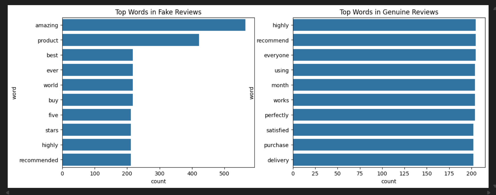
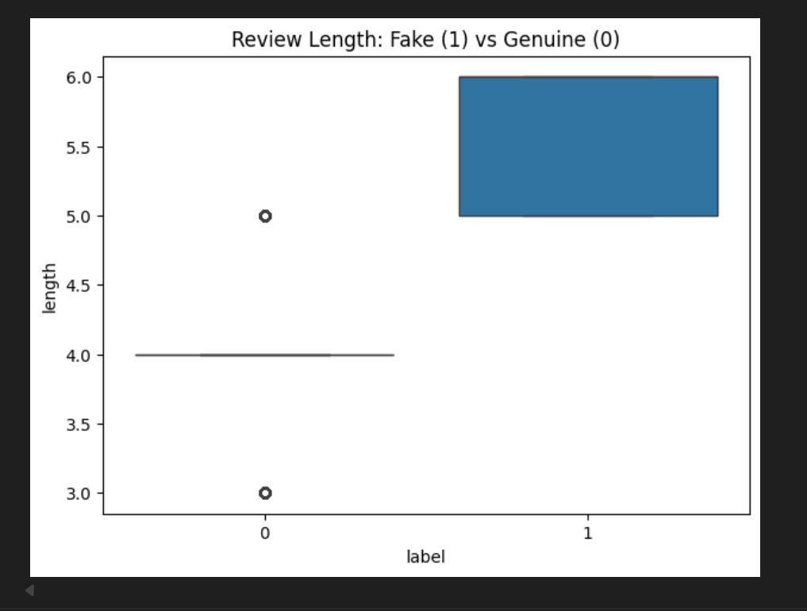

# Intelligent Review Authenticity Prediction System
This project uses  Machine Learning techniques to detect fake and genuine product reviews. 
It analyzes linguistic patterns, review behavior, and word usage to provide accurate predictions along with explainable insights.
##  Overview
This project detects fake and genuine product reviews using NLP and machine learning techniques. 
It analyzes linguistic patterns and review behavior to provide accurate predictions and explainable insights.

##  Key Features
✔ Fake vs genuine review classification  
✔ Text preprocessing & TF-IDF feature extraction  
✔ Word pattern analysis  
✔ Review length behavior analysis  
✔ Probability-based predictions  
✔ Explainable results  

##  Model Performance
Accuracy: 100%  
Includes confusion matrix and classification report.

##  Visual Insights

##  Sample Predictions
The model predicts whether a review is fake or genuine and provides probability scores with reasoning.

##  Technologies Used
Python, NLP, Scikit-learn, Pandas, Matplotlib

## Dataset
Dataset not included due to size/privacy constraints.

##  Applications
Helps e-commerce platforms detect fraudulent reviews and improve customer trust.

